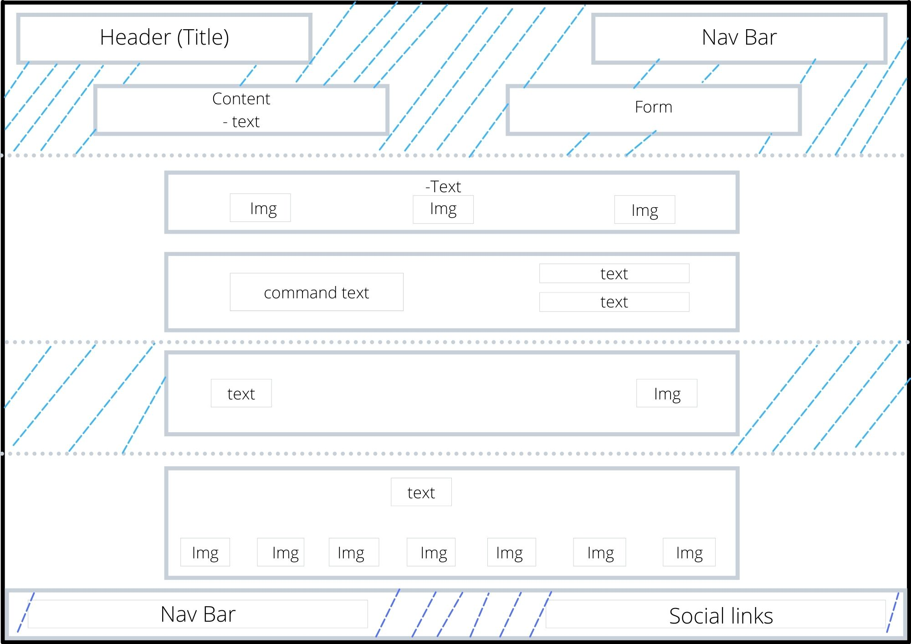

# Design

<!-- give an overview of your project's design -->
<!-- describe the reasoning behind your group's design and wireframe -->
<!-- include other centralized decisions like fonts, palates, ... -->

- In this project the webpage 'Loruki` is replicated and reconstructed.

---

## Wireframe for the Home page

<!-- provide a link to your wireframe documenting on Figma, or wherever it is -->

